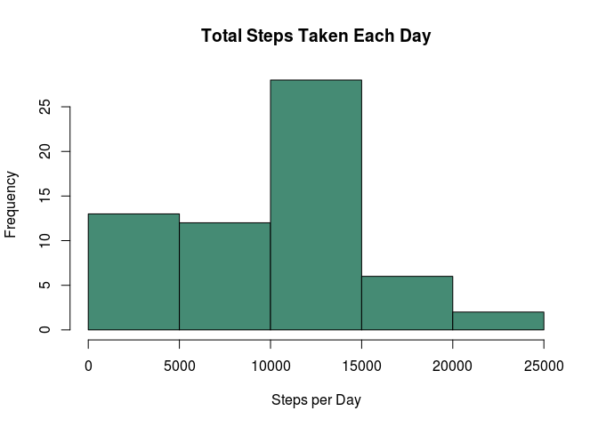
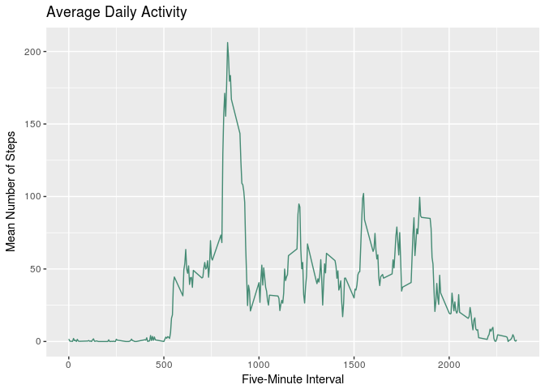
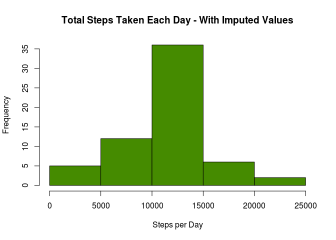
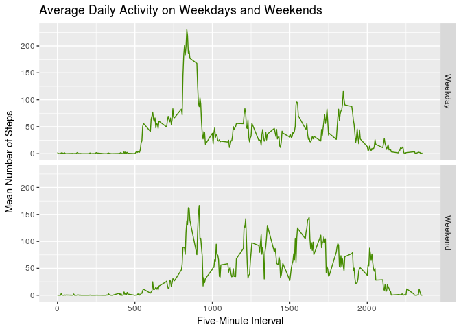

# Reproducible Research: Peer Assessment 1

## Loading and preprocessing the data  

The data is loaded using the `read_csv` function from the `tidyverse` collection of libraries.  

The `unz` function is used within the `read_csv` call in order to extract the file `activity.csv` from its archive.  


```r
if(getwd()!="/home/paul/coursework") {setwd("/home/paul/coursework")}  
library(tidyverse)  
```

```
## Loading tidyverse: ggplot2
## Loading tidyverse: tibble
## Loading tidyverse: tidyr
## Loading tidyverse: readr
## Loading tidyverse: purrr
## Loading tidyverse: dplyr
```

```
## Conflicts with tidy packages ----------------------------------------------
```

```
## filter(): dplyr, stats
## lag():    dplyr, stats
```

```r
activity <- read_csv(unz("RepData_PeerAssessment1/activity.zip", "activity.csv"))  
```

```
## Parsed with column specification:
## cols(
##   steps = col_integer(),
##   date = col_date(format = ""),
##   interval = col_integer()
## )
```

## What is the mean total number of steps taken per day?  

We use functions from the `dplyr` package to calculate the total number of steps taken per day. 

The result of this process is stored in a new data frame called `steps_days`.  


```r
steps_days <- activity %>% group_by(date) %>% summarise(total = sum(steps, na.rm=TRUE))  
```

The following histogram of the total number of steps taken each day is plotted using base R.  


```r
hist(steps_days$total, main="Total Steps Taken Each Day", xlab="Steps per Day", col="aquamarine4")  
```

<!-- -->


```r
mean_steps_days <- mean(steps_days$total)  
median_steps_days <- median(steps_days$total)  
```

The mean of the total number of steps taken per day is 9354.2295082.  

The median of the total number of steps taken per day is 10395.  


## What is the average daily activity pattern?  

The average daily activity pattern is calculated using `dplyr` functions and stored as `steps_intervals`.  


```r
steps_intervals <- activity %>% group_by(interval) %>% summarise(mean = mean(steps, na.rm=TRUE))  
```
We make a time series plot of the mean number of steps, averaged across all days, in the 5-minute measurement intervals using `ggplot`.  


```r
ggplot(steps_intervals, aes(interval, mean)) +  
        geom_line(color="aquamarine4") +  
        ggtitle("Average Daily Activity") +  
        labs(x="Five-Minute Interval", y="Mean Number of Steps")  
```

<!-- -->


```r
interval_max <- as.integer(steps_intervals[which.max(steps_intervals$mean), 1])  
```

The 5-minute interval containing the maximum number of steps on average across all days is 835.  


## Imputing missing values  


```r
missing <- sum(is.na(activity))  
```
The number of rows in the dataset with missing values is 2304.  

We will impute new values for the missing values using the interval means. 

This is done by first joining the calculated interval means to the activity dataset in a new dataset called `activity_imputed`. 

We then overwrite the missing values for `steps` with the associated interval mean.  


```r
activity_imputed <- activity %>%  
        inner_join(steps_intervals, by="interval") %>%  
        mutate(steps=ifelse(is.na(steps), mean, steps))  
```

The total number of steps taken per day is calculated using the dataset with imputed values. 


```r
steps_days_imputed <- activity_imputed %>% group_by(date) %>% summarise(total = sum(steps, na.rm=TRUE))  
```

This is a histogram of the total number of steps taken each day using the imputed values.  


```r
hist(steps_days_imputed$total, main="Total Steps Taken Each Day - With Imputed Values", xlab="Steps per Day", col="chartreuse4")  
```

<!-- -->


```r
mean_steps_days_imputed <- mean(steps_days_imputed$total)  
median_steps_days_imputed <- median(steps_days_imputed$total)  
```

The mean of the total number of steps taken per day is 1.0766189\times 10^{4}.  

The median of the total number of steps taken per day is 1.0766189\times 10^{4}.  

These values differ from the estimates from the first part of the assignment.

Imputing missing data on the estimates of the total daily number of steps causes the mean and median to converge on the same figure.  

The differences between the estimates for the two data sets is shown below.  


```r
estimates <- data.frame(mean = c(mean_steps_days, mean_steps_days_imputed),   median = c(median_steps_days, median_steps_days_imputed))  
estimates  
```

```
##       mean   median
## 1  9354.23 10395.00
## 2 10766.19 10766.19
```

```r
estimates[2,] - estimates[1,]  
```

```
##       mean   median
## 2 1411.959 371.1887
```

## Are there differences in activity patterns between weekdays and weekends?  

In order to explore whether activity patterns differ between weekdays and weekends, we first create a new factor variable `weekpart`.  

This indicates whether an observation was recorded Monday through Friday (weekdays) or on Saturday or Sunday (weekends). 


```r
activity_imputed$weekpart <- as.factor(ifelse(weekdays(activity$date) %in% c("Saturday", "Sunday"), "Weekend", "Weekday"))  

steps_intervals_imputed <- activity_imputed %>% group_by(interval, weekpart) %>% summarise(mean = mean(steps, na.rm=TRUE))  
```

This is a time series panel plot of the mean number of steps in the 5-minute measurement intervals, averaged across all weekday days or weekend days.  


```r
ggplot(steps_intervals_imputed, aes(interval, mean)) +  
        facet_grid(weekpart~.) +  
        geom_line(color="chartreuse4") +  
        ggtitle("Average Daily Activity on Weekdays and Weekends") +  
        labs(x="Five-Minute Interval", y="Mean Number of Steps")  
```

<!-- -->

The major peak in the weekday activity pattern is still present but much smaller in the weekend pattern. 

There is more activity in the intervals between around 1000 and 2000 at the weekend.  

There is less activity in the intervals between around 500 and 800 at the weekend.  
  
  

